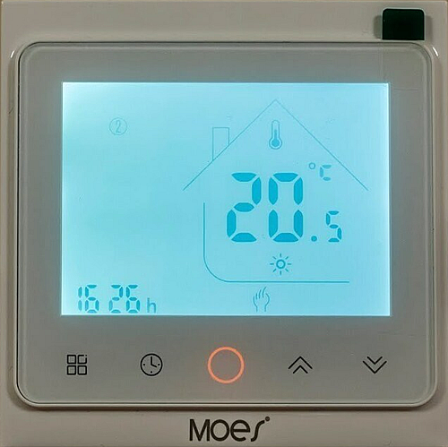
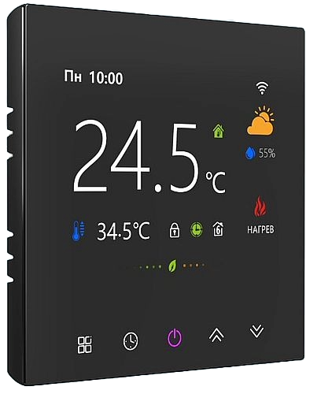
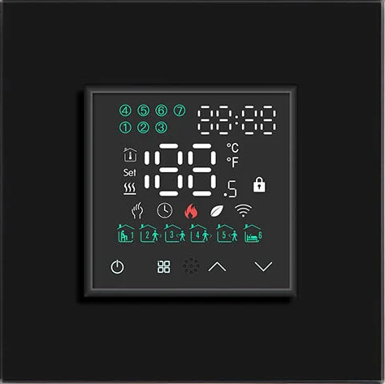
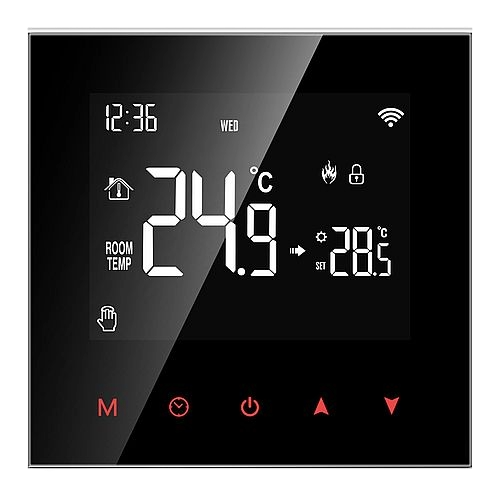
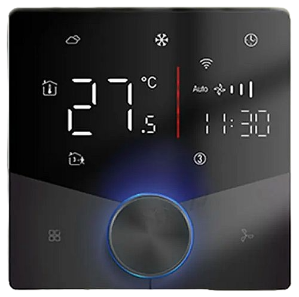
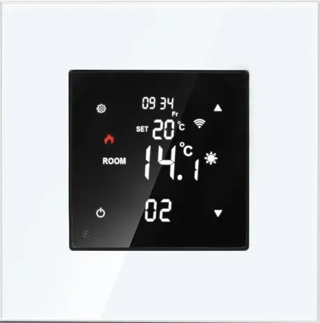

# <a id="Top">Tuya Thermostat for Floor Heating Zigbee with custom firmware</a>

### Custom firmware for Tuya thermostat models

1. Model r01
	- "[_TZE204_u9bfwha0](doc/thermostats/tuya_thermostat_r01/README.md)"
	- "[_TZE204_aoclfnxz](doc/thermostats/tuya_thermostat_r01/README.md)"
2. Model r02
	- ["_TZE200_edl8pz1k"](doc/thermostats/tuya_thermostat_r02/README.md)
	- ["_TZE204_edl8pz1k"](doc/thermostats/tuya_thermostat_r02/README.md)
3. Model r03	
	- ["_TZE204_tagezcph"](doc/thermostats/tuya_thermostat_r03/README.md)
4. Model r04	
	- ["_TZE204_xyugziqv"](doc/thermostats/tuya_thermostat_r04/README.md)
5. Model r05
	- ["_TZE204_5toc8efa"](doc/thermostats/tuya_thermostat_r05/README.md)
6. Model r06
	- ["_TZE204_lzriup1j"](doc/thermostats/tuya_thermostat_r06/README.md)
	- ["_TZE204_oh8y8pv8"](doc/thermostats/tuya_thermostat_r06/README.md)
	- ["_TZE204_gops3slb"](doc/thermostats/tuya_thermostat_r06/README.md)
	- ["_TZE284_cvub6xbb"](doc/thermostats/tuya_thermostat_r06/README.md)
7. Model r07
	- ["_TZE204_mpbki2zm"](doc/thermostats/tuya_thermostat_r07/README.md)
8. Model r08
	- ["_TZE204_7rghpoxo"](doc/thermostats/tuya_thermostat_r08/README.md)
	- ["_TZE200_7rghpoxo"](doc/thermostats/tuya_thermostat_r08/README.md)
9. Model r09
	- ["_TZE204_6a4vxfnv"](doc/thermostats/tuya_thermostat_r09/README.md)
10. Model r0A
	- ["_TZE284_xalsoe3m"](doc/thermostats/tuya_thermostat_r0a/README.md)












**Автор не несет никакой отвественности, если вы, воспользовавшись этим проектом, превратите свой умный термостат в полоумный.**

Проверялись только термостаты перечисленные выше. Если у вас другая сигнатура, лучше не заливать, не проверив на совпадение датапоинтов.

**Теоретически прошивку можно адаптировать для любого термостата у которого IEEE начинается на**

**`A4 C1 38`**


**Если начало IEEE отличается от указанного, то в термостате применен другой чип в Zigbee модуле, и про обновление можно забыть.**

Проверялся только в `zigbee2mqtt`. С апрельской версии 2025 года `zigbee2mqtt` внешний конвертор не нужен. Поддрежка включена глобально.

## Зачем. 

Чтобы не спамил в сеть. Первый экземпляр (см. выше) посылал 25 пакетов каждые 8 секунд.

## Что получилось. 

**About**


**Exposes**


**Reporting**


## Как обновить.

Сначала подключаем к z2m внешний [конвертор](https://github.com/slacky1965/tuya_thermostat_zrd/tree/main/zigbee2mqtt/convertors) `tuya_thermostat_orig.js`. Конвертор активирует OTA в z2m для термостата с прошивкой от Tuya. Его нужно скопировать в директорию `external_converters`, которую нужно создать в корне z2m.

Далее нужно добавить локальное хранилище обновлений. 

Создаем директорию `images` в директории z2m и кладем туда файл [1141-d3a3-1111114b-tuya_thermostat_zrd.zigbee](https://github.com/slacky1965/tuya_thermostat_zrd/raw/refs/heads/main/bin/1141-d3a3-1111114b-tuya_thermostat_zrd.zigbee).

Копируем в директорию z2m файл [local_ota_index.json](https://github.com/slacky1965/tuya_thermostat_zrd/raw/refs/heads/main/zigbee2mqtt/local_ota_index.json)

В конфиг z2m (configuration.yaml) добавляем локальное хранилище

```
ota:
  zigbee_ota_override_index_location: local_ota_index.json
```

Далее перегружаем z2m. И видим у нас новое устройство (если термостат уже был в сети и виден в z2m).


Далее идем в раздел OTA. И видим там свое устройство. Жмем проверить обновления.
	


Жмем на красную кнопку. И обновляемся.


Если все не так, как описано, значит вы что-то сделали не по инструкции (не положили файл куда нужно, не перегрузили z2m) или сигнатуры вашего термостата нет в списке поддерживаемых устройств.

> [!WARNING]
> Внимание!!! Если в процессе вы обнаружите на каких-то устройствах Туя, которые возможно у вас есть еще в системе, новое обновление, то обновлять ничего не нужно!!! Иначе вы зальете в это устройство прошивку от термостата и получите кирпич!!! Если же процесс обновления по ошибке уже начался, то просто обесточьте это устройство!!!

Далее ждем окончания. После этого мы в OTA видим наш термостат со старым именем, но уже с новыми `Firmware build date` и `Firmware version`.


Вот так выглядит лог при первом старте после обновления с прошивки Tuya на кастомную.

```
OTA mode enabled. MCU boot from address: 0x8000
Firmware version: v1.0.04
Tuya bootloader
Bootloader is overwritten. Reset
OTA mode enabled. MCU boot from address: 0x8000
Firmware version: v1.0.04
SDK bootloader
out_pkt <== 0x55AA02000101000003
inp_pkt ==> 0x55AA02000101001C7B2270223A2265646C38707A316B222C2276223A22312E302E30227D8D
Tuya signature found: "edl8pz1k"
Use modelId: Tuya_Thermostat_r02
```

Далее идем в радел `Devices` и жмем на нашем термостате справа символ "i" и подтверждаем. Таким образом мы заставляем устройство пройти интервью заново.


Далее опять справа жмем символ . Тем самым заставляя устройство пройти конфигурирование заново.


Все, термостат готов к работе.

> [!WARNING]
> Внимание!!! Если после успешного обновления и всех выполненных указаний выше термостат остается со старым именем, то удалите его принудительно из сети, перегрузите z2m и сделайте сопряжение по-новой. Если в процессе сопряжения термостат моргает значком сети, но ничего не происходит, нужно снять питание с термостата (обесточить) и подать питание заново.

В Home Assistant это выглядит так


## Как в уже обновленный термостат залить новую версию прошивки.

Все обновления будут доступны через z2m по мере выхода новых релизов, специально делать для этого ничего не нужно.

Все.

P.S. В реальной работе не проверялось, требует всестороннего тестирования.

Более развернутое описание для самого первого термостата [тут](https://habr.com/ru/articles/864740)

---

Связаться со мной можно в **[Telegram](https://t.me/slacky1965)**.

### Если захотите отблагодарить автора, то это можно сделать через [ЮMoney](https://yoomoney.ru/to/4100118300223495)

---

Спасибы :))

- [@ruslikx3m](https://t.me/ruslikx3m) за первый предоставленный термостат `_TZE204_u9bfwha0` на растерзание.

- [@immortal_serg](https://t.me/immortal_serg) за предоставленный термостат `_TZE204_edl8pz1k`.

- [@chernyshevruslan](https://t.me/chernyshevruslan) за предоставленные термостаты `_TZE204_tagezcph` в двух разных исполнениях и `_TZE204_xyugziqv`.

- [@Alleol](https://t.me/Alleol) за предоставленный термостат `_TZE204_lzriup1j`.

- [@terekhins](https://t.me/terekhins) за предоставленный термостат `_TZE204_aoclfnxz` производства `MOES`.

- [@shadow_by](https://t.me/shadow_by) за предоставленный термостат `_TZE204_aoclfnxz` производства `MOES`.

- [@dbunevich](https://t.me/dbunevich) за предоставленный термостат `_TZE204_mpbki2zm`.

- [@liberatemei](https://t.me/liberatemei) за предоставленный термостат `_TZE204_oh8y8pv8`.

- [@rheinx](https://t.me/rheinx) за предоставленный термостат `_TZE204_6a4vxfnv`

- [@Nobodevi4](https://t.me/Nobodevi4) за предоставленный термостат `_TZE284_cvub6xbb`

- [https://github.com/doctor64](https://github.com/doctor64) [@doctor_64](https://t.me/doctor_64) - за желание всегда помочь и направить в правильное русло.

- [https://github.com/devbis](https://github.com/devbis) [@Belokobylskiy](https://t.me/Belokobylskiy) - за идеи и написание скриптов на Питоне и для конвертора z2m.

- [@goofyk](https://t.me/goofyk) - за терпение и за хорошее знание z2m.

- [https://github.com/pvvx](https://github.com/pvvx) - за замечательный программматор для чипов Telink.

## История версий
- 1.0.01
	- Начало.
- 1.0.02
	- Релиз. Удален из-за проблемы с обновлением OTA.
- 1.0.03
	- Устранена проблема с возможностью установить температуру нагрева выше порога, заданного в maxHeatSetpoint. 
	- Откорректирован конвертор на предмет проброса термостата в Home Assistant. 
	- Добавлены функции callback удаленных команд в структуру DataPoint'ов. 
	- Протестирован термостат с сигнатурой `_TZE204_aoclfnxz`. Устранена проблема с обновлением OTA.
- 1.0.03a
	- ПреРелиз.
- 1.0.04
	- Добавлен термостат с сигнатурой `_TZE204_edl8pz1k`. 
	- Добавлены функции callback локальных команд в структуру DataPoint'ов.
	- Добавлен `watchdog`.
	- Изменено формирование zb_modelId. 
		> Теперь при обновление на кастомную прошивку, термостаты с разными сигнатурами, но по сути являющиеся одинковыми устройствами, будут получать одинаковое групповое имя, не зависимо от сигнатуры.
		
	- Изменены коверторы z2m, теперь это всего два файла. 
		> Один для термостата с оригинальной прошивкой, второй для уже термостата с кастомной прошивкой. Что-то менять в них не нужно.
- 1.0.05
	- Добавлен термостат с сигнатурой `_TZE204_tagezcph`
		> Проверяли два термостата, один с поворотной ручкой внизу посередине, второй внизу справа.
	- Отредактированы внутренние имена переменных, связанных с номером модели.
		> Раньше счет шел от 0. Сейчас от 1. Сделано просто для удобства, чтобы самому не запустаться. Например, раньше было type0, теперь это type1 и т.д.
	- Обновлены конверторы.
- 1.0.06
	- Добавлен термостат с сигнатурой `_TZE204_xyugziqv`
	- Увеличен буфер uart до 512 байт. Последний термостат присылает за один раз очень много пакетов.
	- Обновлены конверторы
- 1.0.07
	- Устранена проблема с количеством запущенных таймеров. В z2m все работало, а в ZHA перегружалось.
- 1.0.08
	- Обновлено SDK до версии [V3.7.1.2](https://github.com/telink-semi/telink_zigbee_sdk/releases/tag/V3.7.1.2)
	- Обновлен `local_ota_index.js` - явно указаны устройства, которые подлежат обновлению.
	- Изменена инструкция по обновлению - в конце не нужно удалять устройство, достаточно по-новой пройти процедуры интервьюирования и конфигурирования.
- 1.0.09
	- Устранен баг с сохранением настроек и с последующим их восстановлением при подаче питания.
	- Добавлена очистка `watchdog` в работу uart. Могла произойти такая ситуация - при продолжительном неответе MCU ZTU перегружался.
	- Обновлены конверторы для версии `zigbee2mqtt` 2.0.0
	- Обновлена инструкция.
- 1.0.10
	- Добавлен термостат с сигнатурой `_TZE204_5toc8efa` производства BSEED (GL86HTEZ1B).
	- Обновлены конверторы и файл локальной загрузки обновлений.
	- Обновлена инструкция.
- 1.0.11
	- Добавлен термостат с сигнатурой `_TZE204_lzriup1j` производства Avatto (ZWT10016A).
	- Добалено автоопределение скорости работы `UART`. По стандарту [Tuya Zigbee Serial protocol](https://developer.tuya.com/en/docs/mcu-standard-protocol/mcusdk-zigbee-uart-protocol?id=Kdg17v4544p37)  скорость может быть `9600` или `115200`.
	- Добавлено в конвертор для z2m отображение уже имеющегося в термостате расписания.
	- Обновлены конверторы и файл локальной загрузки обновлений.
	- Обновлена инструкция.
- 1.0.12
	- Физически протестирован термостат с сигнатурой `_TZE204_aoclfnxz` производства `MOES`. По результатам модифицирован код обработки входящих и исходящих пакетов в `uart`.
	- В конверторы добавлена сигнатура `_TZE200_edl8pz1k`.
	- Добавлен в сохраняемые и восстанавливающиеся при старте данные параметр `System Mode`. При сбросе модуля этот параметр выставлялся в 0, что удаленными системами воспринималось, как-будто термостат выключен.
- 1.0.13
	- Добавлен термостат с сигнатурой `_TZE204_mpbki2zm`.
- 1.0.14
	- Добавлен термостат с сигнатурой `_TZE204_7rghpoxo`.
	- Обновлены конверторы.
- 1.0.15
	- Изменена очередь исходящих пакетов. Теперь это адаптированный кольцевой буфер.
	- Включена проверка напряжения питания чипа для устранения ошибок при записи во флеш-память когда напряжение меньше 2.2 вольта. Актуально при пропадании питания.
	- Добавлены таймауты для исходящих пакетов.
	- Уменьшено количество исходящих одинаковых ответов для термостатов `_TZE204_edl8pz1k` и `_TZE204_aoclfnxz`, иначе программа часто перегружалась по watchdog'у.
	- Из основной прошивки удален код проверки и перезаписи `bootloader'а` - это была потенциальная угроза порчи boot-сектора при определенных обстаятельствах. Теперь этот код содержится только в прошивке, которая загружается при первом обновлении.
	- При первом обновлении номер версии всегда будет `1.0.00` - сделано специально для скорейшего обновления на основную прошивку, где нет кода проверки и перезаписи `bootloader'а`.
	- Добавлен термостат с сигнатурой `_TZE200_7rghpoxo`. Мной не проверялось, добавлен со слов пользователя, который его проверил.
	- Обновлены конверторы.
- 1.0.16
	- Добавлен термостат с сигнатурой `_TZE204_oh8y8pv8`.
- 1.0.17
	- Добавлен термостат с сигнатурой `_TZE204_gops3slb` (не проверялось, смотрите [issue](https://github.com/slacky1965/tuya_thermostat_zrd/issues/124)).
	- Добавлен термостат с сигнатурой `_TZE204_6a4vxfnv`.
	- Устранена ошибка в SDK с репортингом.
- 1.0.18
	- Добавлен термостат с сигнатурой `_TZE284_cvub6xbb`
- 1.0.19
	- Добавлен термостат с сигнатурой `_TZE284_xalsoe3m`
	- Добавлен термостат с сигнатурой `_TZE204_8byfmxdv`
	- Измененая процедура `Factory Reset`.
	- Добавлена возможность менять `Zigbee model` термостата через топик `mqtt`.
	

[Наверх](#Top)

